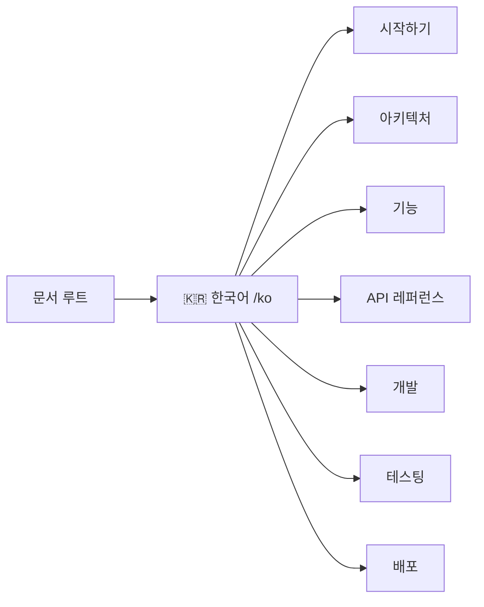

# 📚 GitLab Bulk Manager 문서

GitLab Bulk Manager 문서에 오신 것을 환영합니다!

## 🇰🇷 한국어 문서

[**한국어 문서 보기 →**](./ko/README.md)

---

## 🚀 빠른 링크

- [시작하기](./ko/getting-started.md)
- [아키텍처](./ko/architecture.md)
- [기능](./ko/features.md)
- [API 레퍼런스](./ko/api-reference.md)

## 📋 문서 구조

## 🔧 문서 기여하기

문서에 기여할 때:
- 명확하고 간결한 언어 사용
- 적절한 코드 예제 포함
- 마지막 수정 날짜 업데이트

---

**최종 업데이트**: 2025-07-06