# 📚 GitLab Bulk Manager Documentation

Welcome to the GitLab Bulk Manager documentation!

## 🌐 Available Languages

[**한국어 문서 보기 →**](./ko/README.md)

---

## 🎯 Overview

GitLab Bulk Manager is a powerful tool designed to streamline GitLab administration through bulk operations. It provides an intuitive interface for managing groups, projects, members, and permissions at scale.

### Key Features
- **Bulk CRUD Operations**: Create, update, and delete multiple GitLab resources
- **Group & Project Management**: Hierarchical tree view with drag-and-drop
- **Member Management**: Bulk import and permission assignment
- **Permission Overview**: Comprehensive view of user access levels
- **Real-time Updates**: WebSocket-based job tracking
- **CSV Import**: Batch operations via CSV files

## 🚀 Quick Links

- [Getting Started](./getting-started.md) - Installation and setup guide
- [Architecture](./architecture.md) - Technical architecture overview
- [Features](./features.md) - Detailed feature documentation
- [API Reference](./api-reference.md) - Backend API documentation

## 📋 Documentation Structure

```mermaid
graph LR
    A[Documentation Root] --> E[🇬🇧 English]
    A --> K[🇰🇷 Korean /ko]
    
    E --> E1[Getting Started]
    E --> E2[Architecture]
    E --> E3[Features]
    E --> E4[API Reference]
    
    K --> K1[시작하기]
    K --> K2[아키텍처]
    K --> K3[기능]
    K --> K4[API 레퍼런스]
```

## 🔧 Contributing to Documentation

When contributing to documentation:
- Use clear and concise language
- Include practical code examples
- Update the last modified date
- Maintain consistency across languages

---

**Last Updated**: 2025-07-24