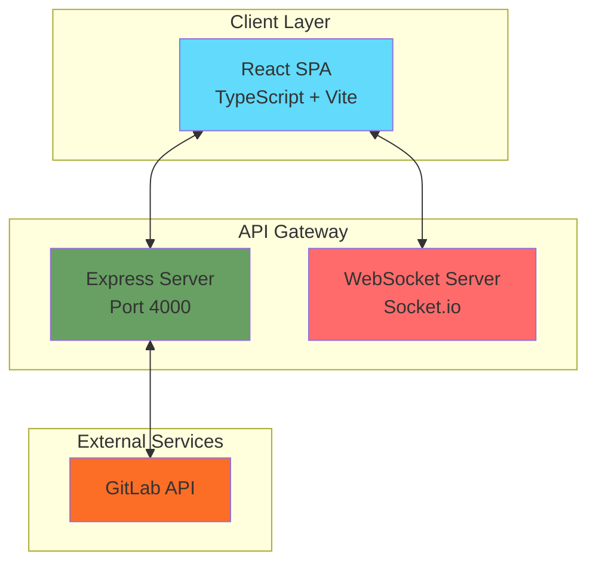
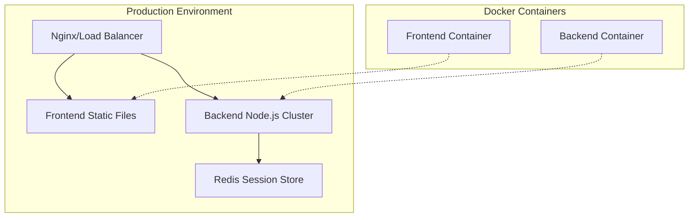

# Architecture

## Overview

The GitLab Bulk Manager is built as a modern web application with a React frontend and Express backend. It follows a component-based architecture with clear separation of concerns, focusing on efficient bulk operations for GitLab administration.

## System Architecture



## Frontend Architecture

```
┌─────────────────────────────────────────────────────────────┐
│                         Frontend (React)                      │
├─────────────────────────────────────────────────────────────┤
│  ┌─────────────┐  ┌──────────────┐  ┌──────────────────┐   │
│  │   Pages     │  │  Components  │  │     Services     │   │
│  │             │  │              │  │                  │   │
│  │ Dashboard   │  │  GitLabTree  │  │  GitLabService   │   │
│  │ Groups      │  │  Layout      │  │  AuthService     │   │
│  │ Projects    │  │  Bulk/*      │  │  WebSocketService│   │
│  │ BulkOps     │  │  Common/*    │  │                  │   │
│  └─────────────┘  └──────────────┘  └──────────────────┘   │
│                                                              │
│  ┌─────────────────────────────────────────────────────┐   │
│  │                  State Management                     │   │
│  │  ┌────────────┐  ┌────────────┐  ┌──────────────┐  │   │
│  │  │   Store    │  │   Slices   │  │  RTK Query   │  │   │
│  │  │            │  │            │  │              │  │   │
│  │  │ AppStore   │  │ AuthSlice  │  │ GitLabAPI    │  │   │
│  │  │            │  │ UISlice    │  │              │  │   │
│  │  └────────────┘  └────────────┘  └──────────────┘  │   │
│  └─────────────────────────────────────────────────────┘   │
└─────────────────────────────────────────────────────────────┘
```

## Backend Architecture

```mermaid
graph LR
    subgraph "Express Server"
        A[Middleware Stack]
        B[Route Handlers]
        C[Session Management]
    end
    
    subgraph "API Routes"
        D[/api/auth/*]
        E[/api/gitlab/*]
        F[/api/bulk/*]
        G[/api/permissions/*]
        H[/api/stats/*]
    end
    
    subgraph "Services"
        I[GitLab API Client]
        J[WebSocket Service]
        K[Job Queue]
    end
    
    A --> B
    B --> D
    B --> E
    B --> F
    B --> G
    B --> H
    
    E --> I
    F --> I
    F --> J
    F --> K
```

## Core Concepts

### Component Architecture

#### Page Components
Located in `/src/pages/`, these are top-level route components:
- **Dashboard**: Overview and statistics
- **GroupsProjects**: Unified tree view for groups and projects
- **BulkOperations**: CSV import operations
- **SystemHealth**: System monitoring and health checks
- **Documentation**: Integrated documentation viewer

#### Shared Components
Located in `/src/components/`:
- **GitLabTree with Permissions**: Integrated tree view showing access levels
- **Layout**: App shell with navigation
- **ErrorBoundary**: Global error handling
- **PrivateRoute**: Authentication guard

#### Feature Components
Organized by feature in subdirectories:
- `/components/bulk/`: Import components for groups, projects, members
- `/components/common/`: Shared UI components
- `/components/dialogs/`: Modal dialogs

### State Management

#### Redux Store Structure
```typescript
{
  auth: {
    isAuthenticated: boolean;
    user: User | null;
    gitlabUrl: string | null;
    loading: boolean;
    error: string | null;
  },
  ui: {
    loading: boolean;
    error: string | null;
    notifications: Notification[];
  },
  // RTK Query managed state
  api: {
    gitlab: { /* query cache */ },
  }
}
```

#### State Management Architecture
- **Redux Toolkit**: Global state management
- **RTK Query**: Server state caching and synchronization
- **WebSocket Integration**: Real-time updates for bulk operations
- **Session-based Auth**: Secure token storage on backend

### Service Layer

#### GitLabService
Central service for GitLab API operations:
```typescript
interface GitLabService {
  // Groups
  getGroups(params?: GroupParams): Promise<Group[]>
  createGroup(data: CreateGroupData): Promise<Group>
  updateGroup(id: number, data: UpdateGroupData): Promise<Group>
  deleteGroup(id: number): Promise<void>
  
  // Projects
  getProjects(params?: ProjectParams): Promise<Project[]>
  getGroupProjects(groupId: number): Promise<Project[]>
  createProject(data: CreateProjectData): Promise<Project>
  
  // Members
  getGroupMembers(groupId: number): Promise<Member[]>
  addGroupMember(groupId: number, data: AddMemberData): Promise<Member>
  
  // Bulk Operations
  bulkCreateGroups(data: BulkGroupData[]): Promise<BulkResult>
  bulkCreateProjects(data: BulkProjectData[]): Promise<BulkResult>
  bulkAddMembers(data: BulkMemberData[]): Promise<BulkResult>
}
```

### Routing Strategy

Using React Router v6 with nested routes:
```typescript
<Routes>
  <Route path="/login" element={<Login />} />
  <Route path="/" element={<PrivateRoute><Layout /></PrivateRoute>}>
    <Route index element={<Navigate to="/dashboard" />} />
    <Route path="dashboard" element={<Dashboard />} />
    <Route path="groups-projects" element={<GroupsProjects />} />
    <Route path="bulk-operations" element={<BulkOperations />} />
    <Route path="system-health" element={<SystemHealth />} />
    <Route path="docs" element={<Documentation />} />
  </Route>
</Routes>
```

### Data Flow

1. **User Action** → Component event handler
2. **API Call** → Backend proxy endpoint
3. **Backend Processing** → GitLab API call with authentication
4. **State Update** → Redux store update via RTK Query
5. **UI Update** → React re-render with new data

### Security Considerations

#### Authentication
- Session-based authentication with backend token storage
- GitLab PAT never exposed to frontend
- Secure httpOnly cookies for session management
- CSRF protection through session validation

#### API Security
- All GitLab API calls proxied through backend
- Rate limiting implemented on backend
- Request validation and sanitization
- Secure session management

### Performance Patterns

#### Code Splitting
```typescript
const Dashboard = lazy(() => import('./pages/Dashboard'));
const BulkOperations = lazy(() => import('./pages/BulkOperations'));
```

#### Memoization
```typescript
const MemoizedTree = memo(GitLabTree, (prev, next) => {
  return prev.selectedNodeId === next.selectedNodeId;
});
```

#### Virtual Scrolling
For large lists in GitLabTree component:
```typescript
import { VariableSizeList } from 'react-window';
```

### Error Handling

#### Global Error Boundary
Catches unhandled errors and displays fallback UI:
```typescript
<ErrorBoundary fallback={<ErrorFallback />}>
  <App />
</ErrorBoundary>
```

#### API Error Handling
Consistent error handling across all API calls:
```typescript
try {
  const result = await api.call();
} catch (error) {
  if (error.response?.status === 401) {
    // Handle authentication error
    dispatch(logout());
  } else {
    // Show error notification
    dispatch(showError(error.message));
  }
}
```

### WebSocket Integration

Real-time updates for bulk operations:
```typescript
// Job progress tracking
socket.on('job:progress', (data) => {
  dispatch(updateJobProgress(data));
});

// Bulk operation updates
socket.on('bulk:update', (data) => {
  dispatch(updateBulkOperation(data));
});
```

### Testing Strategy

#### Unit Tests
- Component testing with React Testing Library
- Service layer testing with Jest
- Redux slice testing

#### Integration Tests
- API integration tests with MSW
- Component integration tests
- WebSocket event testing

#### E2E Tests
- Playwright for end-to-end testing
- Critical user flows coverage

## Deployment Architecture



### Production Considerations

- **Static File Serving**: Frontend built as static files
- **Process Management**: PM2 for Node.js clustering
- **Session Persistence**: Redis for distributed sessions
- **Environment Variables**: Secure configuration management
- **Health Checks**: Endpoint monitoring and auto-restart
- **Logging**: Centralized log aggregation
- **Monitoring**: Performance and error tracking

---

**Last Updated**: 2025-07-24