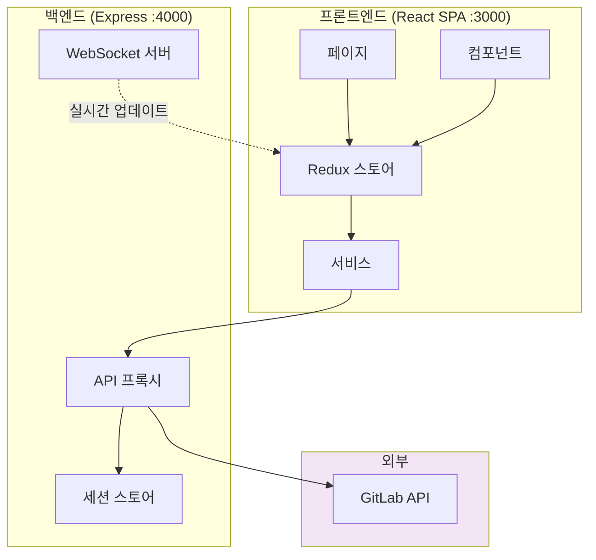

# 📚 프론트엔드 문서

GitLab Bulk Manager 프론트엔드 애플리케이션을 위한 종합 문서입니다.

## 📑 목차

### 🚀 시작하기

- **[시작 가이드](./getting-started.md)** - 설치, 설정 및 첫 단계
- **[개발 가이드](./development.md)** - 개발 환경 설정 및 워크플로우

### 🏗️ 아키텍처 & 설계

- **[아키텍처 개요](./architecture.md)** - 시스템 아키텍처, 패턴 및 설계 결정
- **[컴포넌트 문서](./components.md)** - 상세한 컴포넌트 레퍼런스 및 사용법
- **[API 통합](./api-integration.md)** - 백엔드 API 통신 및 서비스 레이어

### ✨ 기능

- **[기능 개요](./features.md)** - 전체 기능 문서
- **[권한 트리](./permission-tree.md)** - 사용자 권한 시각화 컴포넌트

### 🧪 개발 & 테스팅

- **[테스팅 가이드](./testing.md)** - 단위, 통합 및 E2E 테스팅 전략
- **[배포 가이드](./deployment.md)** - 프로덕션 배포 및 DevOps

### 🔧 레퍼런스

- **[API 레퍼런스](./api-reference.md)** - 전체 API 엔드포인트 문서
- **[문제 해결](./troubleshooting.md)** - 일반적인 문제와 해결책

## 🏗️ 프로젝트 아키텍처



## 📁 프로젝트 구조

```
frontend/
├── src/
│   ├── components/         # 재사용 가능한 UI 컴포넌트
│   │   ├── GitLabTree.tsx      # 권한이 포함된 계층적 트리 뷰
│   │   ├── ErrorBoundary.tsx   # 전역 에러 처리
│   │   ├── Layout.tsx          # 앱 레이아웃 래퍼
│   │   └── bulk/               # 대량 작업 컴포넌트
│   │       ├── BulkImportDialog.tsx
│   │       ├── BulkSettingsDialog.tsx
│   │       └── ...
│   ├── pages/              # 라우트 페이지 컴포넌트
│   │   ├── GroupsProjects.tsx  # 메인 그룹 & 프로젝트 페이지
│   │   ├── SystemHealth.tsx    # 시스템 모니터링
│   │   └── Documentation.tsx   # 인앱 문서 뷰어
│   ├── services/           # API 서비스 레이어
│   │   ├── gitlab.ts          # GitLab API 클라이언트
│   │   └── axiosConfig.ts     # HTTP 클라이언트 설정
│   ├── store/              # Redux 상태 관리
│   │   ├── index.ts           # 스토어 설정
│   │   └── slices/            # Redux 슬라이스
│   │       ├── authSlice.ts
│   │       ├── gitlabSlice.ts
│   │       └── uiSlice.ts
│   ├── hooks/              # 커스텀 React 훅
│   ├── types/              # TypeScript 정의
│   ├── utils/              # 유틸리티 함수
│   └── config/             # 설정 상수
├── public/                 # 정적 자산
├── docs/                   # 이 문서
└── tests/                  # 테스트 파일
```

## 🚀 주요 기능

### 🌳 통합된 그룹 & 프로젝트 뷰

- **트리 뷰**: 드래그 앤 드롭이 가능한 계층적 네비게이션
- **권한 통합**: 인라인으로 표시되는 접근 레벨
- **대량 작업**: 툴바 액션과 함께 다중 선택
- **Developer+ 필터**: 개발자 이상 권한만 표시

### 📦 대량 작업

- **대량 가져오기**: 다이얼로그를 통한 YAML/CSV 가져오기
- **대량 설정**: 가시성, 브랜치, 규칙 업데이트
- **대량 이동**: 여러 항목 드래그 앤 드롭
- **대량 삭제**: 여러 항목 한번에 제거

### 🔐 인증 및 보안

- **세션 기반 인증**: 서버 사이드에 안전한 토큰 저장
- **CORS 보호**: 모든 API 호출이 백엔드 프록시를 통과
- **요청 제한**: 내장된 요청 스로틀링

### 📡 실시간 업데이트

- **WebSocket 통합**: 실시간 진행 상황 추적
- **작업 관리**: 백그라운드 작업 모니터링
- **자동 새로고침**: 데이터 동기화 유지

## 🛠️ 기술 스택

| 분류           | 기술          | 버전 | 용도                |
| -------------- | ------------- | ---- | ------------------- |
| **프레임워크** | React         | 18.x | UI 라이브러리       |
| **언어**       | TypeScript    | 5.x  | 타입 안전성         |
| **상태관리**   | Redux Toolkit | 2.x  | 상태 관리           |
| **UI**         | Material-UI   | 5.x  | 컴포넌트 라이브러리 |
| **빌드**       | Vite          | 5.x  | 빌드 도구           |
| **라우팅**     | React Router  | 6.x  | 네비게이션          |
| **HTTP**       | Axios         | 1.x  | API 클라이언트      |
| **WebSocket**  | Socket.io     | 4.x  | 실시간 업데이트     |

## 📊 문서 커버리지

| 섹션         | 상태    | 설명                    |
| ------------ | ------- | ----------------------- |
| 시작하기     | ✅ 완료 | 설치 및 설정 가이드     |
| 아키텍처     | ✅ 완료 | 시스템 설계 및 패턴     |
| 컴포넌트     | ✅ 완료 | 컴포넌트 문서           |
| API 통합     | ✅ 완료 | 백엔드 통합 가이드      |
| 기능         | ✅ 완료 | 기능 문서               |
| 개발         | ✅ 완료 | 개발 워크플로우         |
| 테스팅       | ✅ 완료 | 테스팅 전략             |
| 배포         | ✅ 완료 | 배포 가이드             |
| API 레퍼런스 | 🆕 신규 | API 엔드포인트 레퍼런스 |
| 문제 해결    | 🆕 신규 | 일반적인 문제 가이드    |

## 🔄 빠른 네비게이션

| ← 이전                    | 홈                      | 다음 →                           |
| ------------------------- | ----------------------- | -------------------------------- |
| [언어 선택](../README.md) | [문서 홈](../README.md) | [시작하기](./getting-started.md) |

## 📞 도움 받기

도움이 필요하신 경우:

1. [문제 해결 가이드](./troubleshooting.md) 확인
2. [API 레퍼런스](./api-reference.md) 검토
3. 코드베이스에서 예제 찾기
4. GitHub에 이슈 생성

---

**[🇺🇸 View English Version](../en/README.md)**
