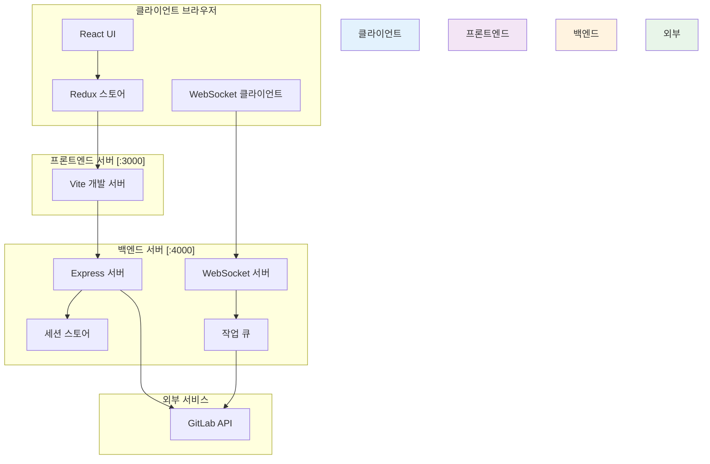
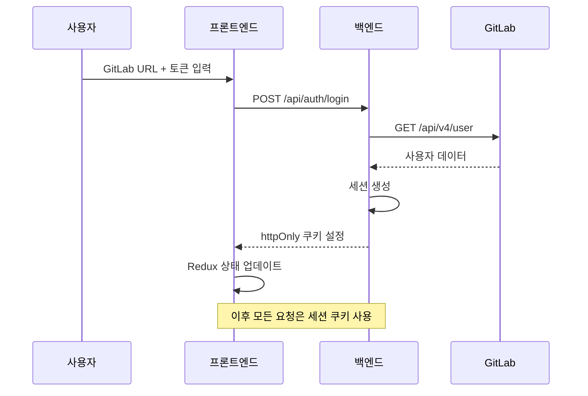
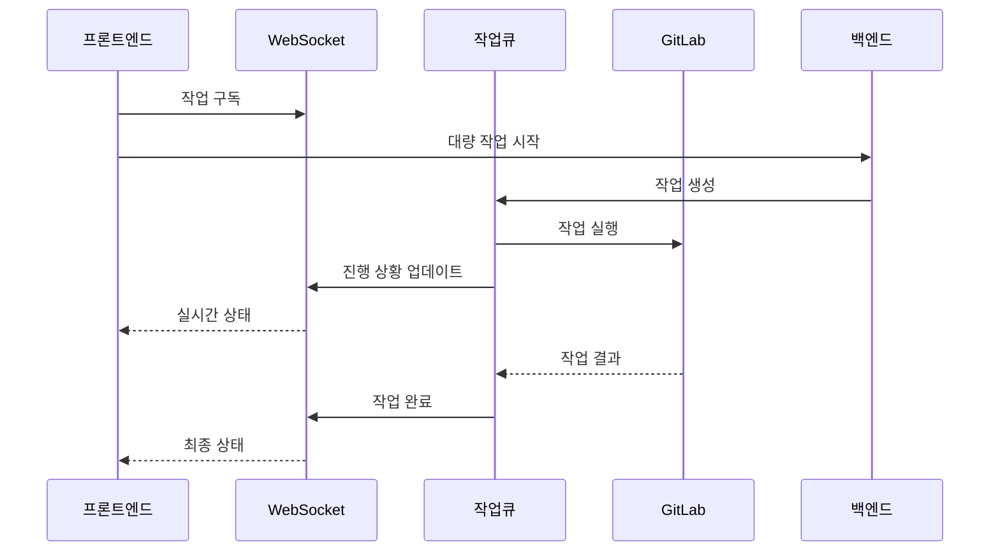
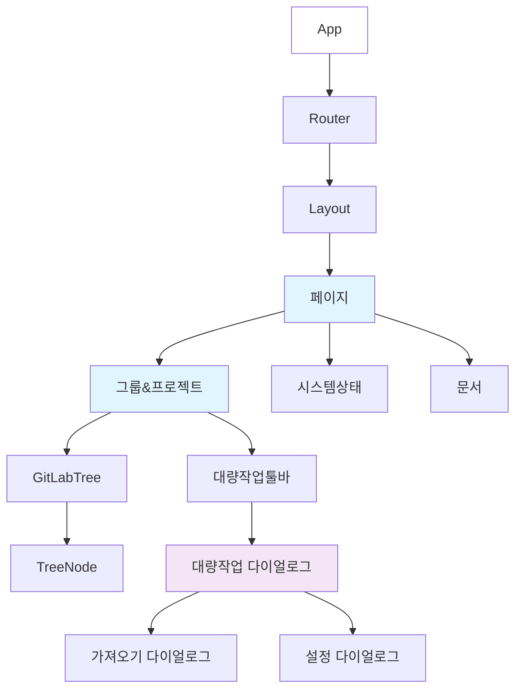
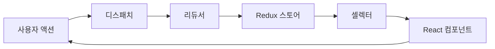
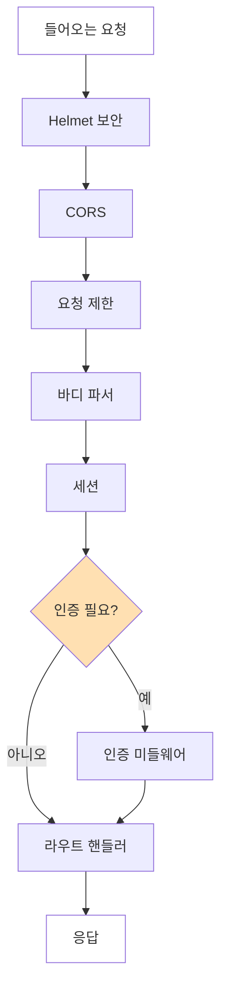
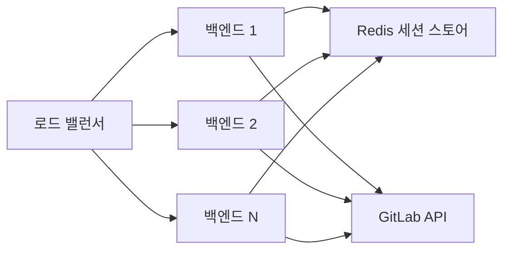

# 🏗️ 아키텍처 개요

이 문서는 React와 TypeScript로 구축된 현대적인 웹 애플리케이션인 GitLab Bulk Manager의 기술 아키텍처를 설명합니다.

## 📐 시스템 아키텍처

### 고수준 아키텍처



### 3계층 아키텍처 패턴

애플리케이션은 전통적인 3계층 아키텍처를 따릅니다:

1. **프레젠테이션 계층** (프론트엔드)
   - Material-UI를 사용한 React SPA
   - 상태 관리를 위한 Redux
   - 실시간 업데이트를 위한 WebSocket

2. **애플리케이션 계층** (백엔드)
   - Express.js API 서버
   - 세션 기반 인증
   - GitLab API 프록시
   - 작업 큐 시스템

3. **데이터 계층**
   - 주요 데이터 소스로서의 GitLab
   - 인증을 위한 세션 스토어
   - 메모리 내 작업 큐

## 🎯 핵심 설계 원칙

### 1. API 프록시로서의 백엔드
모든 GitLab API 호출이 백엔드를 통과하는 이유:
- CORS 문제 방지
- 안전한 토큰 저장 (서버 사이드만)
- 요청 제한 구현
- 재시도 로직 추가
- 중앙 집중식 오류 처리

### 2. 세션 기반 인증


### 3. WebSocket을 통한 실시간 업데이트


## 📁 프론트엔드 아키텍처

### 컴포넌트 계층 구조



### 상태 관리

#### Redux 스토어 구조
```typescript
interface RootState {
  auth: {
    isAuthenticated: boolean
    user: User | null
    gitlabUrl: string | null
    loading: boolean
    error: string | null
  }
  
  gitlab: {
    groups: Group[]
    projects: Project[]
    selectedItems: string[]
    expandedNodes: string[]
    loading: boolean
    error: string | null
  }
  
  ui: {
    theme: 'light' | 'dark'
    notifications: Notification[]
    dialogs: {
      import: boolean
      settings: boolean
    }
  }
}
```

#### 데이터 흐름


### 서비스 레이어 아키텍처

```typescript
// 서비스 레이어 구조
services/
├── gitlab.ts          // GitLab API 클라이언트
├── auth.ts           // 인증 서비스
├── websocket.ts      // WebSocket 클라이언트
└── axiosConfig.ts    // HTTP 클라이언트 설정

// 서비스 패턴 예시
class GitLabService {
  private api: AxiosInstance
  
  constructor() {
    this.api = axios.create({
      baseURL: '/api/gitlab',
      withCredentials: true
    })
  }
  
  async getGroups(params?: GroupParams): Promise<Group[]> {
    const response = await this.api.get('/groups', { params })
    return response.data
  }
}
```

## 🔧 백엔드 아키텍처

### API 라우트 구조

```
/api/
├── auth/
│   ├── login         POST   - 사용자 인증
│   ├── logout        POST   - 세션 종료
│   └── session       GET    - 세션 확인
│
├── gitlab/
│   ├── groups        GET    - 그룹 목록
│   ├── projects      GET    - 프로젝트 목록
│   └── *            ANY    - GitLab 프록시
│
├── gitlab/bulk/
│   ├── import        POST   - 대량 가져오기
│   ├── settings      PUT    - 대량 설정
│   └── delete        DELETE - 대량 삭제
│
├── permissions/
│   └── overview      GET    - 권한 트리
│
├── stats/
│   └── summary       GET    - 통계
│
└── docs/
    └── *            GET    - 문서
```

### 미들웨어 스택



### 오류 처리 전략

```javascript
// 중앙 집중식 오류 처리
app.use((err, req, res, next) => {
  const status = err.status || 500
  const message = err.message || '내부 서버 오류'
  
  logger.error({
    error: message,
    status,
    url: req.url,
    method: req.method,
    ip: req.ip
  })
  
  res.status(status).json({
    error: message,
    ...(process.env.NODE_ENV === 'development' && { stack: err.stack })
  })
})
```

## 🔐 보안 아키텍처

### 인증 흐름
1. 사용자가 GitLab URL과 개인 액세스 토큰 제공
2. 백엔드가 GitLab API로 토큰 검증
3. 안전한 httpOnly 세션 쿠키 생성
4. 토큰은 서버 사이드 세션에만 저장
5. 모든 API 요청이 세션을 통해 인증됨

### 보안 조치
- **Helmet.js**: 보안 헤더
- **CORS**: 프론트엔드 출처만 허용
- **요청 제한**: API 남용 방지
- **세션 보안**: httpOnly, secure, sameSite 쿠키
- **입력 검증**: 모든 입력 정제
- **오류 처리**: 오류에 민감한 데이터 없음

## 🚀 성능 최적화

### 프론트엔드 최적화
- **코드 분할**: 라우트 기반 지연 로딩
- **메모이제이션**: 비용이 많이 드는 컴포넌트에 React.memo
- **가상 스크롤링**: 큰 목록용 (계획됨)
- **디바운싱**: 검색 및 필터 작업
- **캐싱**: API 응답용 React Query

### 백엔드 최적화
- **요청 배치**: 대량 작업
- **요청 제한**: 설정 가능한 지연
- **연결 풀링**: HTTP 연결 재사용
- **Gzip 압축**: 응답 압축
- **캐싱 헤더**: 정적 자산 캐싱

## 📊 확장성 고려사항

### 수평 확장


### 향후 개선사항
- 세션 저장소용 Redis
- 작업 처리용 메시지 큐
- 감사 로깅용 데이터베이스
- 정적 자산용 CDN
- Kubernetes 배포

## 🔄 빠른 네비게이션

<div align="center">

| ← 이전 | 홈 | 다음 → |
|--------|-----|--------|
| [시작하기](./getting-started.md) | [한국어 문서](./README.md) | [기능](./features.md) |

</div>

---

<div align="center">

**[🇺🇸 View English Version](../en/architecture.md)**

</div>