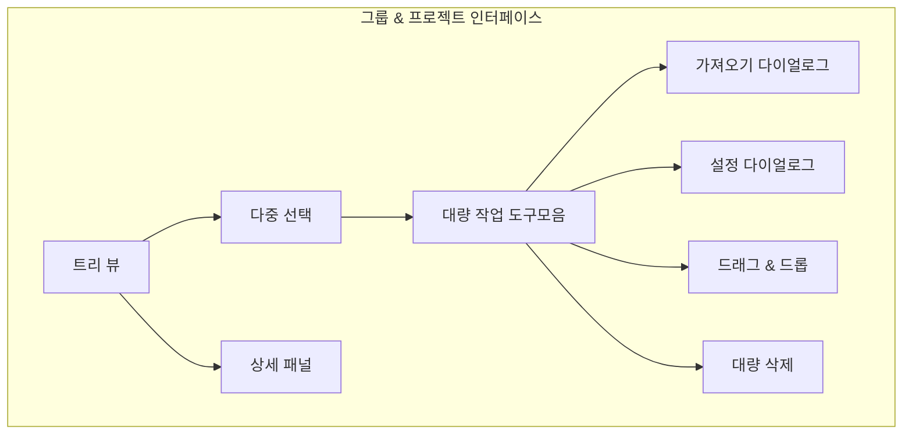
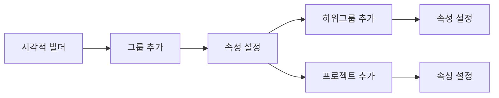
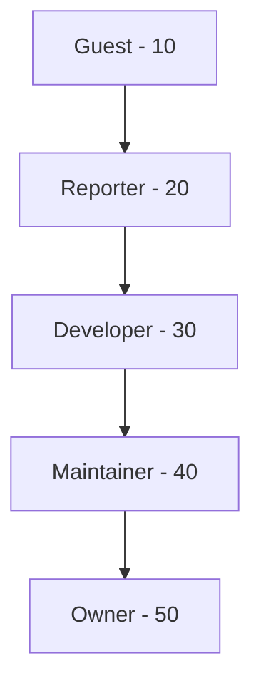
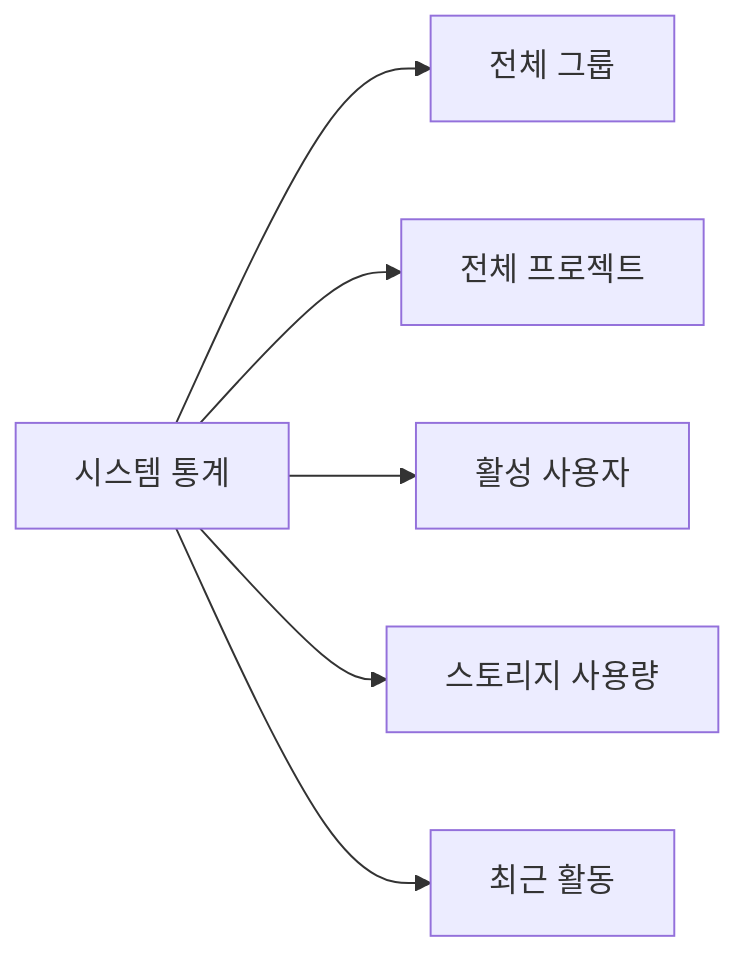
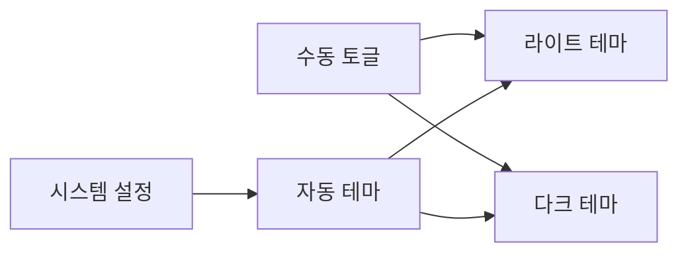
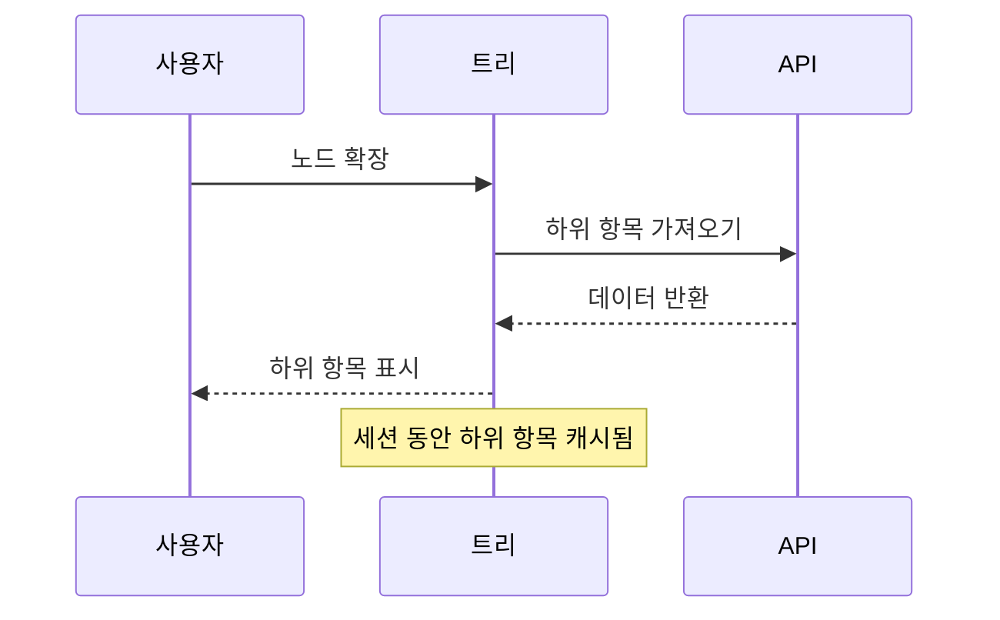

# ✨ 기능 개요

GitLab Bulk Manager는 GitLab 그룹, 프로젝트 및 권한을 대규모로 관리할 수 있는 강력한 도구를 제공합니다.

## 🌳 그룹 & 프로젝트 관리

### 통합 트리 뷰
메인 인터페이스는 그룹과 프로젝트 관리를 하나의 직관적인 트리 뷰로 통합합니다.



#### 주요 기능:
- **계층적 탐색**: 전체 GitLab 구조 탐색
- **통합된 권한**: 트리에서 직접 접근 레벨 확인
- **다중 선택**: 대량 작업을 위한 여러 항목 선택
- **실시간 검색**: 그룹과 프로젝트 즉시 필터링
- **Developer+ 필터**: Developer 이상 접근 권한만 표시

### 드래그 & 드롭 작업
```
📁 소스 그룹
  📄 프로젝트 A  ─┐
  📄 프로젝트 B  ─┤ 선택한 여러 항목을
  📄 프로젝트 C  ─┘ 드래그
         ↓
📁 대상 그룹
  📄 프로젝트 A (이동됨)
  📄 프로젝트 B (이동됨)
  📄 프로젝트 C (이동됨)
```

## 📦 대량 작업

### 대량 가져오기
YAML 또는 시각적 빌더를 사용하여 여러 그룹과 프로젝트를 가져옵니다.

#### YAML 가져오기 예제
```yaml
groups:
  - name: 백엔드 팀
    path: backend-team
    description: 백엔드 개발팀
    visibility: private
    subgroups:
      - name: 서비스
        path: services
        projects:
          - name: API 게이트웨이
            path: api-gateway
          - name: 인증 서비스
            path: auth-service
```

#### 시각적 빌더


### 대량 설정 업데이트

#### 가시성 설정
여러 항목의 가시성을 한 번에 업데이트:
- **Private**: 프로젝트 멤버만 접근 가능
- **Internal**: 로그인한 사용자만 접근 가능
- **Public**: 누구나 접근 가능

#### 보호된 브랜치
대량으로 브랜치 보호 규칙 설정:
```javascript
{
  name: "main",
  push_access_level: 40,        // Maintainer
  merge_access_level: 30,       // Developer
  unprotect_access_level: 40,   // Maintainer
  allow_force_push: false,
  code_owner_approval_required: true
}
```

#### 푸시 규칙 (GitLab Premium)
여러 프로젝트에 푸시 규칙 적용:
- 커밋 메시지 정규식
- 브랜치 이름 정규식
- 작성자 이메일 정규식
- 파일 이름 정규식
- 최대 파일 크기
- 금지된 파일 이름

#### 접근 레벨
멤버 접근 레벨 대량 업데이트:


## 🔐 권한 관리

### 권한 트리 뷰
전체 GitLab 인스턴스에서 접근 레벨을 시각화합니다.

```
📊 그룹 & 프로젝트 (권한 포함)
├─ 📁 개발팀 [Owner]
│  ├─ 📁 프론트엔드 [Maintainer]
│  │  ├─ 📄 웹사이트 [Developer]
│  │  └─ 📄 모바일앱 [Developer]
│  └─ 📁 백엔드 [Owner]
│     ├─ 📄 API [Maintainer]
│     └─ 📄 서비스 [Maintainer]
└─ 📁 DevOps [Developer]
   └─ 📄 인프라 [Reporter]
```

### 접근 레벨 표시
- **Owner** 👑 - 전체 제어
- **Maintainer** 🔧 - 프로젝트 관리 가능
- **Developer** 💻 - 보호된 브랜치에 푸시 가능
- **Reporter** 📊 - 이슈 보기 및 생성 가능
- **Guest** 👁️ - 제한된 읽기 접근

## 📊 시스템 상태 모니터링

### 실시간 통계
GitLab 인스턴스 상태 모니터링:



### 성능 지표
- API 응답 시간
- 대량 작업 성공률
- 활성 작업 모니터링
- 오류 추적

## 🔍 고급 검색 & 필터

### 검색 기능
- **퍼지 검색**: 오타가 있어도 항목 찾기
- **정규식 지원**: 고급 패턴 매칭
- **다중 필드 검색**: 이름, 경로 또는 설명으로 검색

### 필터 옵션
```typescript
interface FilterOptions {
  visibility: 'all' | 'public' | 'internal' | 'private'
  accessLevel: 'all' | 'owner' | 'maintainer' | 'developer' | 'reporter' | 'guest'
  type: 'all' | 'group' | 'project'
  archived: boolean
  hasIssues: boolean
  hasWiki: boolean
}
```

## 📱 사용자 인터페이스 기능

### 다크 모드
시스템 설정에 따른 자동 테마 전환 또는 수동 토글.



### 반응형 디자인
- **데스크톱**: 분할 창 레이아웃의 전체 기능
- **태블릿**: 접을 수 있는 패널이 있는 적응형 레이아웃
- **모바일**: 단일 열 뷰 (제한된 기능)

### 접근성 기능
- **키보드 탐색**: 전체 키보드 지원
- **스크린 리더**: ARIA 레이블 및 알림
- **고대비**: 향상된 가시성 모드
- **포커스 표시**: 명확한 포커스 상태

## 🚀 성능 기능

### 지연 로딩


### 낙관적 업데이트
백그라운드에서 작업이 완료되는 동안 UI가 즉시 업데이트됩니다:
1. 사용자가 작업 수행
2. UI가 낙관적으로 업데이트
3. API 호출 실행
4. 성공 시: UI 상태 유지
5. 실패 시: 오류 메시지와 함께 되돌리기

## 📚 문서 통합

### 인앱 문서
- 컨텍스트 기반 도움말
- 검색 가능한 문서
- 코드 예제
- 비디오 튜토리얼 (계획됨)

### API 레퍼런스
다음을 포함한 대화형 API 문서:
- 엔드포인트 설명
- 요청/응답 예제
- 직접 시도 기능
- 요청 제한 정보

## 🔄 통합 기능

### WebSocket 실시간 업데이트
- 실시간 진행 상황 추적
- 다중 사용자 협업
- 즉각적인 알림
- 변경 시 자동 새로고침

### 내보내기 기능
여러 형식으로 데이터 내보내기:
- **CSV**: 스프레드시트 분석용
- **JSON**: 프로그래밍 사용용
- **YAML**: 구성 관리용
- **PDF**: 보고용 (계획됨)

## 🎯 예정된 기능

### 계획된 개선사항
- **예약된 작업**: 특정 시간에 대량 작업 실행
- **템플릿**: 가져오기 구성 저장 및 재사용
- **감사 로그**: 상세한 기록으로 모든 변경 사항 추적
- **웹훅**: 외부 시스템과 통합
- **모바일 앱**: 네이티브 모바일 경험

### 커뮤니티 요청사항
- GitLab CI/CD 파이프라인 관리
- 이슈 및 머지 리퀘스트 대량 작업
- 사용자 정의 필드 지원
- 고급 보고 대시보드

## 🔄 빠른 네비게이션

<div align="center">

| ← 이전 | 홈 | 다음 → |
|--------|-----|--------|
| [아키텍처](./architecture.md) | [한국어 문서](./README.md) | [API 통합](./api-integration.md) |

</div>

---

<div align="center">

**[🇺🇸 View English Version](../en/features.md)**

</div>