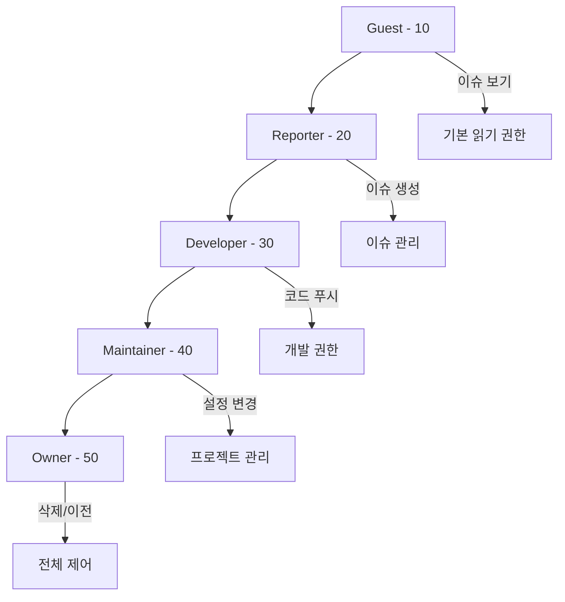
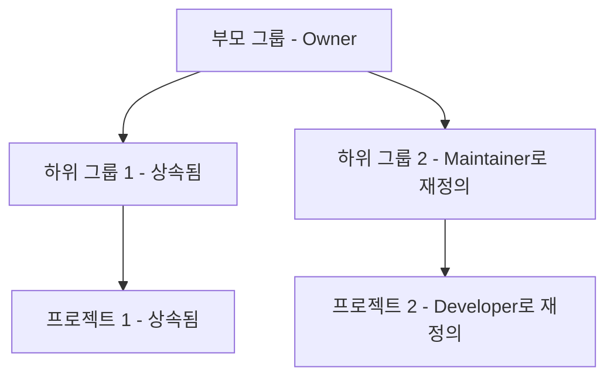

# 🌳 권한 트리 문서

## 개요

권한 트리는 GitLab Bulk Manager의 핵심 기능으로, 사용자의 GitLab 그룹 및 프로젝트 전반에 걸친 접근 권한을 시각화합니다. 이제 메인 트리 뷰에 직접 통합되어 그룹/프로젝트 계층과 함께 권한을 표시합니다.

## 주요 기능

### 통합된 권한 표시
- 그룹/프로젝트 트리에서 직접 권한 정보 확인
- 각 항목에 대한 멤버 수 및 접근 레벨 표시
- Developer+ 필터로 Developer 이상 권한만 표시

### 시각적 표현
```
📁 GitLab 인스턴스
├─ 📁 Frontend 팀 [Owner] (15명)
│  ├─ 📄 웹 앱 [Maintainer] (8명)
│  └─ 📄 모바일 앱 [Developer] (12명)
└─ 📁 Backend 팀 [Guest] (20명)
   └─ 📄 API 서버 [접근 권한 없음]
```

## 접근 레벨

### GitLab 접근 레벨 계층


### 권한 상속


## 컴포넌트 통합

### GitLabTree 컴포넌트 개선
권한 정보가 트리 뷰에 직접 표시됩니다:

```typescript
interface TreeNodeWithPermissions {
  id: string;
  name: string;
  type: 'group' | 'project';
  access_level?: number;
  member_count: number;
  children?: TreeNodeWithPermissions[];
}
```

### 색상 코딩
각 접근 레벨은 고유한 색상으로 표시됩니다:
- **Owner**: `#ff6b6b` (빨간색) - 최고 권한
- **Maintainer**: `#4dabf7` (파란색) - 관리 권한
- **Developer**: `#51cf66` (녹색) - 개발 권한
- **Reporter**: `#868e96` (회색) - 보고 권한
- **Guest**: `#adb5bd` (연한 회색) - 기본 권한

## 사용 사례

### 1. 권한 감사
조직 전체의 권한 구조를 한눈에 파악:
- 과도한 권한 식별
- 접근 권한이 없는 프로젝트 발견
- 권한 불일치 확인

### 2. 팀 구조 이해
```
📁 회사
├─ 📁 개발팀 [Owner]
│  ├─ 📁 프론트엔드 [Maintainer]
│  │  └─ 개발자들이 여기서 작업
│  └─ 📁 백엔드 [Maintainer]
│     └─ API 개발자들의 작업 공간
└─ 📁 디자인팀 [Reporter]
   └─ 디자인 리소스 및 문서
```

### 3. 대량 권한 관리
여러 그룹/프로젝트 선택 후 대량 권한 변경:
1. 트리에서 여러 항목 선택
2. 대량 작업 도구모음 사용
3. 접근 레벨 일괄 변경

## API 통합

### 권한 데이터 가져오기
```typescript
// GET /api/permissions/overview
const permissionsData = await fetch('/api/permissions/overview');

// 응답 구조
{
  groups: [{
    id: 123,
    name: "Frontend Team",
    full_path: "company/frontend",
    access_level: 50,  // Owner
    member_count: 15,
    projects: [{
      id: 456,
      name: "Web App",
      access_level: 40,  // Maintainer
      member_count: 8
    }],
    subgroups: [...]
  }]
}
```

### 권한 캐싱
```typescript
// 5분 동안 권한 데이터 캐싱
const CACHE_DURATION = 5 * 60 * 1000;
```

## 성능 최적화

### 지연 로딩
큰 조직 구조의 경우:
1. 최상위 그룹만 초기 로드
2. 사용자가 확장할 때 하위 항목 로드
3. 로드된 데이터는 메모리에 캐시

### 병렬 요청
```typescript
// 여러 그룹의 권한을 병렬로 가져오기
const promises = groups.map(group => 
  fetchGroupPermissions(group.id)
);
const results = await Promise.all(promises);
```

## 필터링 옵션

### Developer+ 필터
Developer 이상의 접근 권한만 표시:
```typescript
const filterDeveloperPlus = (node: TreeNode) => {
  return node.access_level >= 30; // Developer = 30
};
```

### 검색 기능
권한 트리 내에서 검색:
- 그룹/프로젝트 이름으로 검색
- 특정 접근 레벨로 필터링
- 사용자 이름으로 검색

## 보안 고려사항

### 권한 표시 제한
- 사용자는 자신이 접근할 수 있는 그룹/프로젝트의 권한만 볼 수 있음
- 민감한 그룹 구조는 숨김 처리

### 감사 로깅
권한 변경 사항 추적:
```typescript
interface PermissionAuditLog {
  timestamp: Date;
  user: string;
  action: 'grant' | 'revoke' | 'change';
  target: { type: 'group' | 'project'; id: number };
  oldLevel?: number;
  newLevel?: number;
}
```

## UI/UX 개선사항

### 인터랙티브 기능
1. **호버 효과**: 권한 세부정보 툴팁
2. **클릭 동작**: 권한 편집 다이얼로그
3. **드래그 앤 드롭**: 권한 복사/이동

### 접근성
- 키보드 네비게이션 지원
- 스크린 리더 호환
- 고대비 모드 지원

## 문제 해결

### 일반적인 문제

#### 권한이 표시되지 않음
- GitLab 토큰에 `read_api` 권한 확인
- 네트워크 연결 상태 확인
- 브라우저 캐시 새로고침

#### 잘못된 권한 표시
- GitLab에서 최신 권한 동기화
- 상속된 권한과 직접 권한 구분
- 그룹 멤버십 확인

## 향후 개선 계획

### 계획된 기능
1. **권한 히스토리**: 시간에 따른 권한 변경 추적
2. **권한 템플릿**: 표준 권한 세트 정의 및 적용
3. **권한 리포트**: PDF/CSV 내보내기
4. **권한 알림**: 권한 변경 시 알림

### 성능 개선
- Virtual DOM을 사용한 대규모 트리 렌더링
- WebWorker를 사용한 백그라운드 데이터 처리
- 증분 로딩 및 업데이트