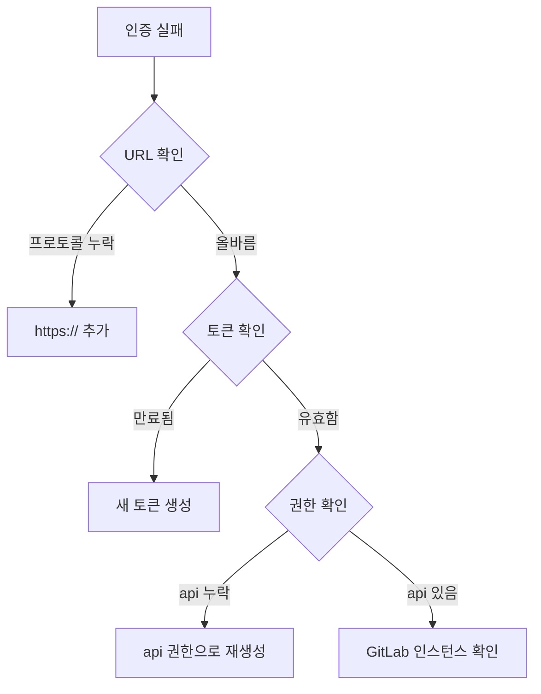

# 🔧 문제 해결 가이드

이 가이드는 GitLab Bulk Manager의 일반적인 문제를 해결하는 데 도움을 줍니다.

## 🚨 일반적인 문제

### 인증 문제

#### "인증 실패" 오류


**해결 방법:**
1. URL에 프로토콜 포함 확인: `https://gitlab.com`
2. GitLab 설정에서 토큰 만료 여부 확인
3. 토큰에 `api` 권한이 있는지 확인:
   ```bash
   curl -H "PRIVATE-TOKEN: your-token" \
        "https://gitlab.com/api/v4/user"
   ```
4. 자체 호스팅 GitLab의 경우, 인스턴스 접근 가능 여부 확인

#### 세션 만료
**증상:**
- 갑자기 로그아웃됨
- 모든 요청에서 401 오류

**해결 방법:**
```javascript
// 세션 상태 확인
fetch('/api/auth/session')
  .then(res => res.json())
  .then(data => {
    if (!data.authenticated) {
      window.location.href = '/login';
    }
  });
```

### 연결 문제

#### 백엔드에 연결할 수 없음
**오류:** `ERR_CONNECTION_REFUSED`

**디버깅 단계:**
```bash
# 1. 백엔드 실행 여부 확인
./manage.sh status

# 2. 백엔드 로그 확인
tail -f logs/backend.log

# 3. 백엔드 상태 테스트
curl http://localhost:4000/health

# 4. 포트 사용 확인
lsof -i:4000
```

**일반적인 원인:**
- 백엔드가 시작되지 않음
- 포트 4000이 이미 사용 중
- 방화벽이 연결을 차단

#### CORS 오류
**오류:** `Access to fetch at 'http://localhost:4000' from origin 'http://localhost:3000' has been blocked by CORS policy`

**해결 방법:**
1. 백엔드 CORS 설정 확인:
   ```javascript
   // backend/src/config/cors.js
   export const corsConfig = {
     origin: 'http://localhost:3000',
     credentials: true
   }
   ```

2. 프론트엔드 API 설정 확인:
   ```javascript
   // frontend/src/services/axiosConfig.ts
   axios.defaults.baseURL = 'http://localhost:4000/api'
   axios.defaults.withCredentials = true
   ```

### 성능 문제

#### 느린 트리 로딩
**증상:**
- 트리 확장에 오랜 시간 소요
- 큰 그룹 로딩 시 UI 멈춤

**해결 방법:**
1. API 호출에서 페이지네이션 활성화:
   ```typescript
   const params = {
     per_page: 50,  // 페이지 크기 감소
     page: 1
   }
   ```

2. 가상 스크롤링 구현 (계획된 기능)

3. 검색을 사용하여 결과 필터링:
   ```typescript
   // 클라이언트 측 대신 API 레벨에서 필터링
   const filtered = await gitlab.getGroups({ search: 'backend' })
   ```

#### 메모리 누수
**증상:**
- 시간이 지남에 따라 브라우저 메모리 사용량 증가
- 페이지가 느려짐

**디버그:**
```javascript
// 이벤트 리스너 누수 확인
useEffect(() => {
  const handler = () => { /* ... */ };
  window.addEventListener('resize', handler);
  
  // 정리가 필수
  return () => {
    window.removeEventListener('resize', handler);
  };
}, []);
```

### 대량 작업 실패

#### 가져오기가 조용히 실패
**디버깅 단계:**
1. WebSocket 연결 확인:
   ```javascript
   socket.on('connect_error', (error) => {
     console.error('WebSocket 오류:', error);
   });
   ```

2. 작업 진행 상황 모니터링:
   ```javascript
   socket.on('job:error', (data) => {
     console.error('작업 실패:', data);
   });
   ```

3. 상세 오류를 위해 백엔드 로그 확인

#### 요청 제한 초과
**오류:** `429 Too Many Requests`

**해결 방법:**
1. 요청 간 지연 시간 증가:
   ```javascript
   // backend/src/routes/bulk.js
   const delay = 500; // 200ms에서 증가
   ```

2. 지수 백오프 구현:
   ```javascript
   async function retryWithBackoff(fn, maxRetries = 3) {
     for (let i = 0; i < maxRetries; i++) {
       try {
         return await fn();
       } catch (error) {
         if (error.response?.status === 429 && i < maxRetries - 1) {
           await new Promise(resolve => 
             setTimeout(resolve, Math.pow(2, i) * 1000)
           );
         } else {
           throw error;
         }
       }
     }
   }
   ```

### UI 문제

#### 컴포넌트가 업데이트되지 않음
**증상:**
- 변경사항이 UI에 반영되지 않음
- 오래된 데이터 표시

**해결 방법:**
1. Redux DevTools 확인:
   ```javascript
   // Redux DevTools Extension 설치
   window.__REDUX_DEVTOOLS_EXTENSION__ && 
   window.__REDUX_DEVTOOLS_EXTENSION__()
   ```

2. 상태 업데이트 확인:
   ```typescript
   // Redux Toolkit의 immer 사용
   updateGroup: (state, action) => {
     const group = state.groups.find(g => g.id === action.payload.id);
     if (group) {
       Object.assign(group, action.payload);
     }
   }
   ```

#### 다크 모드 문제
**증상:**
- 색상이 변경되지 않음
- 일관되지 않은 테마

**해결 방법:**
```typescript
// 테마 프로바이더 확인
const theme = createTheme({
  palette: {
    mode: darkMode ? 'dark' : 'light',
  },
});

// 모든 컴포넌트가 테마를 사용하는지 확인
const StyledComponent = styled('div')(({ theme }) => ({
  backgroundColor: theme.palette.background.paper,
  color: theme.palette.text.primary,
}));
```

### 데이터 문제

#### 누락된 멤버 수
**증상:**
- 멤버 수가 0 또는 undefined로 표시

**원인:** GitLab API 엔드포인트 차이

**구현된 해결책:**
```javascript
// backend/src/routes/permissions.js
try {
  // 먼저 /members/all 시도
  members = await gitlab.get(`/groups/${group.id}/members/all`);
} catch (error) {
  if (error.response?.status === 404) {
    // /members로 폴백
    members = await gitlab.get(`/groups/${group.id}/members`);
  }
}
```

#### 불완전한 권한 데이터
**디버그:**
```bash
# API 직접 테스트
curl -H "PRIVATE-TOKEN: your-token" \
     "https://gitlab.com/api/v4/groups/123/members/all"
```

## 🛠️ 디버깅 도구

### 브라우저 개발자 도구

#### 네트워크 탭
- 실패한 요청 확인
- 요청/응답 페이로드 확인
- WebSocket 메시지 모니터링

#### 콘솔
- JavaScript 오류 확인
- 경고 확인
- 전략적으로 콘솔 로깅 사용

#### React 개발자 도구
```javascript
// 컴포넌트 props와 state 검사
// 컴포넌트 렌더 사이클 확인
// 성능 문제 프로파일링
```

### 백엔드 디버깅

#### 디버그 로깅 활성화
```javascript
// backend/.env
NODE_ENV=development
LOG_LEVEL=debug
```

#### Winston 로거 사용
```javascript
import logger from './utils/logger.js';

logger.debug('상세 디버그 정보', { 
  userId: req.session.userId,
  action: 'bulk_import',
  data: importData 
});
```

### API 테스팅

#### cURL 사용
```bash
# 인증 테스트
curl -X POST http://localhost:4000/api/auth/login \
  -H "Content-Type: application/json" \
  -d '{"gitlabUrl":"https://gitlab.com","accessToken":"your-token"}'

# 세션으로 테스트
curl -X GET http://localhost:4000/api/gitlab/groups \
  -H "Cookie: connect.sid=your-session-cookie"
```

#### Postman 사용
1. API 컬렉션 가져오기
2. 환경 변수 설정
3. 체계적으로 엔드포인트 테스트

## 🔍 상태 점검

### 시스템 상태 체크리스트
```bash
#!/bin/bash
# health-check.sh

echo "GitLab Bulk Manager 상태 확인 중..."

# 서비스 확인
./manage.sh status

# API 엔드포인트 확인
curl -s http://localhost:4000/health | jq .
curl -s http://localhost:3000 | grep -q "GitLab Bulk Manager"

# 디스크 공간 확인
df -h | grep -E "/$|/var"

# 메모리 확인
free -h

# 오류 로그 확인
tail -n 50 logs/backend.log | grep -i error
```

## 📞 도움 받기

### 도움 요청 전
1. 이 문제 해결 가이드 확인
2. 기존 GitHub 이슈 검색
3. 로그 검토
4. 시크릿/프라이빗 모드에서 시도
5. 새로 설치하여 테스트

### 이슈 보고 시
포함할 내용:
- 오류 메시지 (전체 스택 추적)
- 재현 단계
- 환경 세부사항 (OS, Node 버전)
- 브라우저 콘솔 출력
- 백엔드 로그
- 네트워크 요청 (HAR 파일)

### 지원 채널
- GitHub Issues: 버그 보고 및 기능 요청
- Discussions: 일반 질문 및 도움
- Documentation: 업데이트 확인