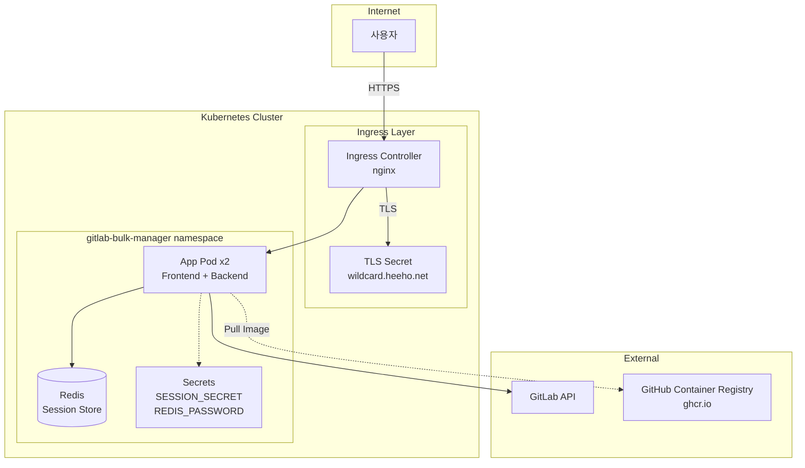

# GitLab Bulk Manager 인프라 배포 가이드

## 아키텍처



## 사전 요구사항

- Kubernetes 클러스터
- kubectl 설치 및 클러스터 연결
- ingress-nginx 컨트롤러
- Reflector (TLS 시크릿 복사용)
- Longhorn 스토리지 클래스

## 빠른 시작

### 1. 시크릿 값 생성

```bash
# SESSION_SECRET 생성 (64자 이상 권장)
openssl rand -base64 64 | tr -d '\n'

# REDIS_PASSWORD 생성
openssl rand -base64 32 | tr -d '\n'
```

### 2. secrets.yaml 수정

```bash
# infra/k8s/secrets.yaml 파일에서 아래 값을 교체:
# - REPLACE_WITH_GENERATED_SECRET
# - REPLACE_WITH_GENERATED_PASSWORD
```

### 3. 배포

```bash
# kustomize로 배포
kubectl apply -k infra/k8s/

# 또는 개별 파일 순서대로 배포
kubectl apply -f infra/k8s/namespace.yaml
kubectl apply -f infra/k8s/secrets.yaml
kubectl apply -f infra/k8s/tls-secret.yaml
kubectl apply -f infra/k8s/redis.yaml
kubectl apply -f infra/k8s/app.yaml
kubectl apply -f infra/k8s/ingress.yaml
```

### 4. 배포 확인

```bash
# 전체 리소스 확인
kubectl get all -n gitlab-bulk-manager

# Pod 상태 확인
kubectl get pods -n gitlab-bulk-manager -w

# 로그 확인
kubectl logs -n gitlab-bulk-manager -l app=gitlab-bulk-manager -f
```

## 이미지 빌드 및 배포

### GitHub Actions (자동 빌드)

태그 푸시 시 자동으로 이미지가 빌드되어 GHCR에 푸시됩니다.

```bash
# 새 버전 태그 생성 및 푸시
git tag v1.0.0
git push origin v1.0.0
```

이미지: `ghcr.io/pghoya2956/gitlab-bulk-manager:1.0.0`

### 배포 업데이트

```bash
# 새 이미지로 롤아웃
kubectl rollout restart deployment/gitlab-bulk-manager -n gitlab-bulk-manager

# 롤아웃 상태 확인
kubectl rollout status deployment/gitlab-bulk-manager -n gitlab-bulk-manager
```

## 검증

### 보안 검증

```bash
# SESSION_SECRET 확인 (기본값이 아닌지)
kubectl get secret gitlab-bulk-manager-secrets -n gitlab-bulk-manager \
  -o jsonpath='{.data.SESSION_SECRET}' | base64 -d

# HTTPS 리다이렉트 확인
curl -I http://gitlab-bulk-manager.heeho.net

# Secure 쿠키 확인
curl -v https://gitlab-bulk-manager.heeho.net/api/auth/session 2>&1 | grep -i set-cookie
```

### 기능 검증

1. https://gitlab-bulk-manager.heeho.net 접속
2. GitLab URL 및 토큰 입력
3. 로그인 성공 확인
4. 새로고침 후 세션 유지 확인

## 문제 해결

### Pod가 시작되지 않는 경우

```bash
# Pod 상세 정보 확인
kubectl describe pod -n gitlab-bulk-manager -l app=gitlab-bulk-manager

# 이벤트 확인
kubectl get events -n gitlab-bulk-manager --sort-by='.lastTimestamp'
```

### Redis 연결 실패

```bash
# Redis Pod 상태 확인
kubectl get pods -n gitlab-bulk-manager -l app=redis

# Redis 로그 확인
kubectl logs -n gitlab-bulk-manager -l app=redis

# Redis 연결 테스트
kubectl exec -it -n gitlab-bulk-manager deploy/redis -- redis-cli -a $REDIS_PASSWORD ping
```

### TLS 인증서 문제

```bash
# TLS 시크릿 확인
kubectl get secret wildcard.heeho.net -n gitlab-bulk-manager

# Reflector 상태 확인 (cert-manager 네임스페이스의 원본)
kubectl get secret wildcard.heeho.net -n cert-manager
```

## 롤백

```bash
# 이전 버전으로 롤백
kubectl rollout undo deployment/gitlab-bulk-manager -n gitlab-bulk-manager

# 전체 삭제
kubectl delete namespace gitlab-bulk-manager
```

## 파일 구조

```
infra/
├── app/
│   ├── Dockerfile        # 통합 이미지 (Frontend + Backend)
│   ├── nginx.conf        # Nginx 설정
│   └── entrypoint.sh     # 컨테이너 시작 스크립트
└── k8s/
    ├── kustomization.yaml
    ├── namespace.yaml
    ├── secrets.yaml      # 시크릿 (수정 필요!)
    ├── tls-secret.yaml   # TLS 인증서 (Reflector)
    ├── redis.yaml        # Redis 세션 스토어
    ├── app.yaml          # 메인 애플리케이션
    └── ingress.yaml      # Ingress 설정
```
