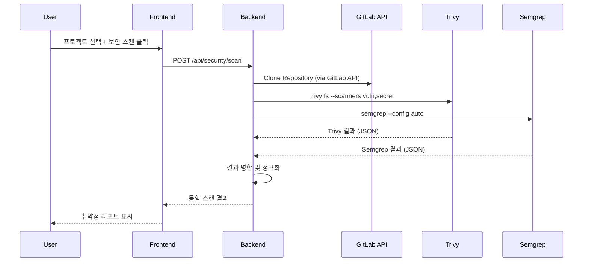

# 보안 스캔 기능 구현 계획

## 개요
GitLab 프로젝트의 소스코드를 대상으로 **Trivy + Semgrep**을 사용하여 보안 취약점을 스캔하고 결과를 표시하는 기능 구현

## 아키텍처



## 구현 범위

### Phase 1: 백엔드 보안 스캔 API
1. **새 라우트 파일**: `backend/src/routes/security.js`
2. **스캔 서비스**: `backend/src/services/securityScanner.js`

### Phase 2: 프론트엔드 UI
1. **다이얼로그 컴포넌트**: `frontend/src/components/bulk/BulkSecurityDialog.tsx`
2. **BulkActionCards.tsx**: `security` 카드 활성화 (`implemented: true`)
3. **BulkActionsCenterRedux.tsx**: 다이얼로그 연결

## 상세 구현

### 1. 백엔드 - `security.js` 라우트

```
POST /api/security/scan
- Body: { projectIds: number[] }
- 프로젝트별로 순차 스캔 (rate limit 고려)
- 각 프로젝트: clone → trivy → semgrep → cleanup

GET /api/security/scan/:scanId
- 스캔 진행 상태 조회 (폴링용)

GET /api/security/results/:projectId
- 최근 스캔 결과 조회 (캐싱 고려)
```

### 2. 백엔드 - `securityScanner.js` 서비스

**스캔 프로세스:**
1. GitLab API로 repo archive 다운로드 (`/api/v4/projects/:id/repository/archive.zip`)
2. 임시 디렉토리에 압축 해제
3. **Trivy 실행**: `trivy fs --format json --scanners vuln,secret,misconfig <dir>`
4. **Semgrep 실행**: `semgrep --config auto --json <dir>`
5. 결과 파싱 및 통합
6. 임시 파일 정리

**취약점 결과 포맷:**
```javascript
{
  projectId: number,
  projectName: string,
  scanDate: ISO8601,
  summary: {
    critical: number,
    high: number,
    medium: number,
    low: number,
    info: number,
    secrets: number
  },
  vulnerabilities: [
    {
      source: 'trivy' | 'semgrep',
      type: 'dependency' | 'code' | 'secret' | 'misconfig',
      severity: 'CRITICAL' | 'HIGH' | 'MEDIUM' | 'LOW' | 'INFO',
      title: string,
      description: string,
      file: string,
      line?: number,
      cve?: string,
      fix?: string
    }
  ]
}
```

### 3. Docker 이미지 수정

**Trivy + Semgrep 설치 추가** (`infra/app/Dockerfile`):
```dockerfile
# Install security scanning tools
RUN apk add --no-cache curl git python3 py3-pip
RUN curl -sfL https://raw.githubusercontent.com/aquasecurity/trivy/main/contrib/install.sh | sh -s -- -b /usr/local/bin
RUN pip3 install semgrep --break-system-packages
```

### 4. 프론트엔드 - `BulkSecurityDialog.tsx`

**UI 구성:**
- **탭 1: 스캔 설정**
  - 대상 프로젝트 목록
  - 스캔 옵션 (Trivy/Semgrep 선택)
  - "스캔 시작" 버튼

- **탭 2: 스캔 결과**
  - 요약: 심각도별 취약점 수 (Critical/High/Medium/Low)
  - 프로젝트별 결과 아코디언
  - 취약점 테이블: 파일, 라인, 심각도, 설명, 수정 가이드

**컴포넌트:**
```
- Severity Badge (Critical=red, High=orange, Medium=yellow, Low=blue)
- Vulnerability Table (sortable, filterable)
- Project Summary Card
- Scan Progress Indicator
```

## 파일 변경 목록

### 신규 파일
| 파일 | 설명 |
|------|------|
| `backend/src/routes/security.js` | 보안 스캔 API 라우트 |
| `backend/src/services/securityScanner.js` | Trivy/Semgrep 실행 서비스 |
| `frontend/src/components/bulk/BulkSecurityDialog.tsx` | 보안 스캔 다이얼로그 |
| `frontend/src/api/security.ts` | 보안 스캔 API 클라이언트 |

### 수정 파일
| 파일 | 변경 내용 |
|------|------|
| `backend/src/index.js` | security 라우트 추가 |
| `infra/app/Dockerfile` | Trivy, Semgrep 설치 |
| `frontend/src/components/BulkActionCards.tsx` | security 카드 활성화 |
| `frontend/src/pages/BulkActionsCenterRedux.tsx` | security 다이얼로그 연결 |

## 기술적 고려사항

### 성능
- 스캔은 시간이 오래 걸림 (프로젝트 크기에 따라 30초~5분)
- 백그라운드 실행 + 폴링 방식 권장
- 동시 스캔 제한 (서버 리소스 보호)

### 보안
- 임시 디렉토리는 스캔 후 즉시 삭제
- GitLab 토큰은 세션에서만 사용 (저장 안 함)
- 스캔 결과는 메모리/캐시에만 유지 (DB 저장 안 함)

### 제한사항
- 프로젝트 크기 제한 (100MB 이상은 경고)
- 동시 스캔 수 제한 (2-3개)
- 스캔 타임아웃 (10분)

## 구현 순서

1. **백엔드 라우트 + 서비스** (security.js, securityScanner.js)
2. **Docker 이미지 수정** (Trivy/Semgrep 설치)
3. **프론트엔드 API 클라이언트** (security.ts)
4. **프론트엔드 다이얼로그** (BulkSecurityDialog.tsx)
5. **통합 및 연결** (index.js, BulkActionCards, BulkActionsCenterRedux)
6. **테스트 및 배포**
